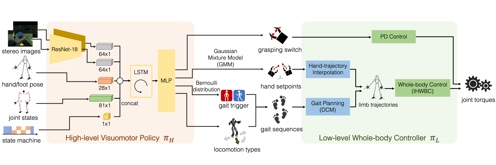

# Implementation Details

The visuomotor policies generate the target task-space commands at 20 Hz. The robot control interface, including hand-trajectory interpolation, gait planning, and whole-body control, is updated and computes the joint-space commands at 100 Hz to actuate the robot. We provide implementation details for reproducibility.

## Whole-body Control
In the whole-body control, we control 26 joints of the robot: 6 joints in each arm and 7 joints in each leg. Due to the knees being designed as rolling contact mechanisms, the two knee joints in each leg are interlinked. Consequently, the whole-body controller computes motor torques for 24 degrees of freedom (DOFs). Additionally, 1 DOF for each gripper is controlled through PD control, which operates outside the whole-body control. Likewise, the pitch joint in the robot's neck is controlled by PD control, and target joint angles are consistent throughout the environments.

In the prioritization scheme of IHWBC [[1]](#1), maintaining body pose stability is always the top priority to ensure safe operation. This is followed by tracking foot pose trajectories and hand pose trajectories, respectively. When the robot is balancing on its two feet in contact with the ground without walking, the priority for tracking hand poses is increased to enhance manipulation performance. However, while the robot is walking, the priority of tracking hand poses is lowered to reduce the impact of hand motions on the robot's overall stability. The prioritization of stabilizing body poses and tracking foot trajectories remains consistent throughout trials.

## Teleoperation Systems
Hand pose setpoints in our teleoperation system are updated at 20 Hz. Smoothing between successive setpoints is achieved through trajectory interpolation, specifically using Hermite curves. For the locomotion commands, we employ the following pre-defined locomotion types:
- <b><i>forward</i>:</b> The robot moves $0.2$ $\text{m}$ forward.
- <b><i>backward</i>:</b> The robot moves $0.2$ $\text{m}$ backward.
- <b><i>left-turn</i>:</b> The robot rotates its body $18$ &deg; in the left direction.
- <b><i>right-turn</i>:</b> The robot rotates its body $18$ &deg; in the right direction.
- <b><i>left-sidewalk</i>:</b> The robot moves $0.1$ $\text{m}$ to the left side without rotating its body.
- <b><i>right-sidewalk</i>:</b> The robot moves $0.1$ $\text{m}$ to the right side without rotating its body.

Upon receiving locomotion commands, gait trajectories are generated by the DCM planner, and the robot then executes them. The teleoperation system is designed to accept new locomotion commands only after the current gait sequence has been fully completed.

## Visuomotor Policy Architecture

The controller's state machine assigns discrete values to track the robot's walking phases. These include the initiation and termination of ground contact for each leg, the swinging phase for each leg, and the balanced state when both feet are on the ground. The values of the state machine are essential for the visuomotor policy to effectively handle the robot's locomotion states. The robot's hand and foot positions are provided in Cartesian coordinates and quaternions in the robot's body frame. Joint positions are encoded using concatenated vectors of their sine and cosine values. The RGB images used as inputs are $400 \times 300$ pixels. The visuomotor policy employs two separate image encoders based on the ResNet18 architecture [[2]](#2). These encoders share the same architecture and are both trained end-to-end.

After the image features are encoded, they are flattened and concatenated with the data representing the robot's hand and foot poses, joint states, and the state machine value. This combined vector is then processed by recurrent neural networks. For the RNNs, we use Long Short-Term Memory (LSTM) networks [[3]](#3) of two layers with 400 hidden units for each layer. Finally, the policy outputs are delivered through a two-layer Multi-Layer Perceptron (MLP), with each layer containing 1024 hidden units. The GMM policy output has 5 modes.

For both the GMM and the Bernoulli distribution, the policy outputs the distribution parameters. Using the output of the GMM, we determine the next target pose for each hand by calculating the differences in Cartesian coordinates and quaternions from the frame of the previous hand pose. For the locomotion commands, a binary <i>gait trigger</i>, sampled from a Bernoulli distribution, decides whether to commence the robot's walking.  When the <i>gait trigger</i> is activated, the robot plans its gait trajectories according to the <i>locomotion types</i> output by the policy. During the execution of these gait sequences, the robot disregards any new locomotion commands until the sequence is complete. After completion, it can accept new commands. 

For imitation learning, we employ behavioral cloning. We use the cross-entropy loss for action losses associated with grasping and the <i>locomotion types</i>, as they are discrete outputs. For sampling of hand setpoints and the <i>gait trigger</i>, we apply the negative log-likelihood loss for the probability distributions.

## References
<a id="1">[1]</a> J. Ahn, S. J. Jorgensen, S. H. Bang, and L. Sentis. Versatile locomotion planning and control for humanoid robots, Frontiers in Robotics and AI, p. 257, 2021.

<a id="2">[2]</a> K. He, X. Zhang, S. Ren, and J. Sun. Deep residual learning for image recognition. In Proceedings of the IEEE conference on computer vision and pattern recognition, 2016.

<a id="1">[3]</a> S. Hochreiter and J. Schmidhuber. Long short-term memory. Neural computation, 9(8), 1997.
